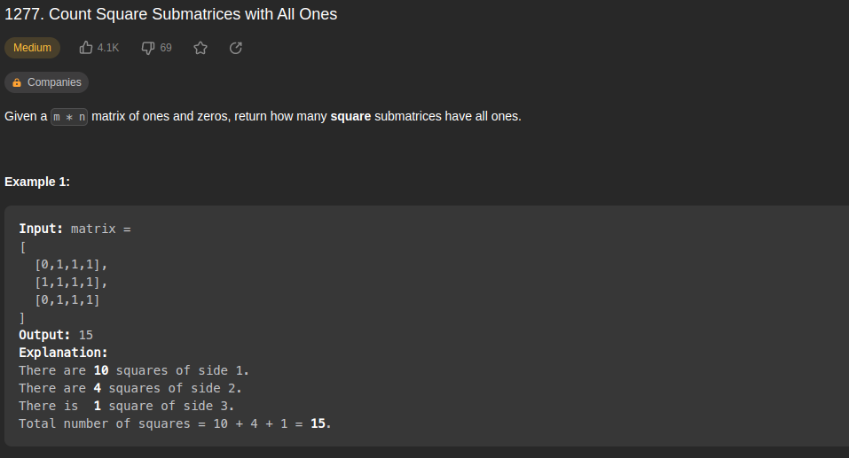
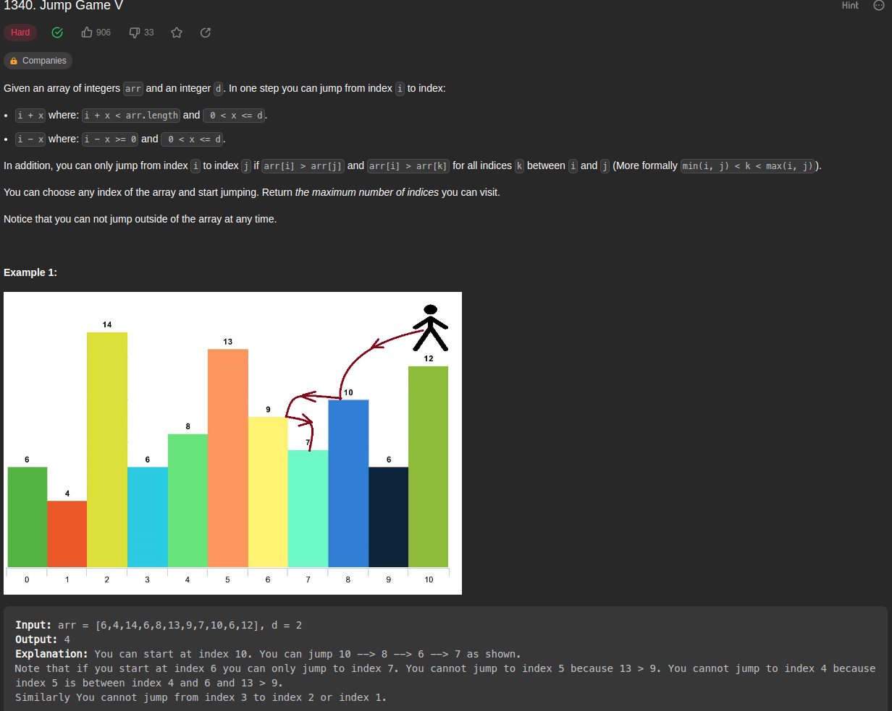
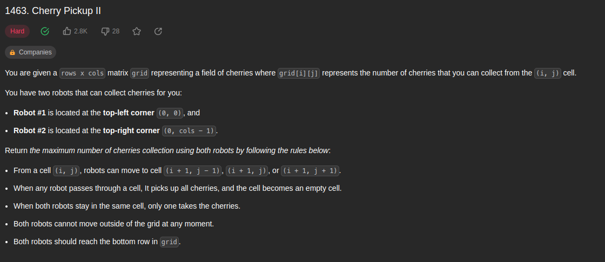
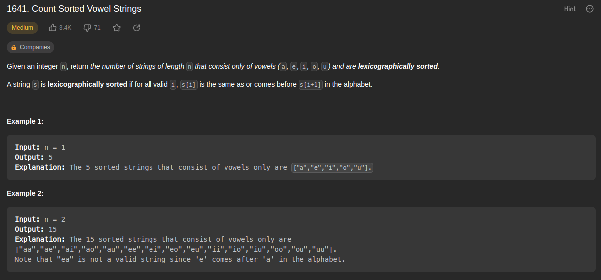

# PD_exercicios_resolvidos

**Número da Lista**: 5 
**Conteúdo da Disciplina**: Programação Dinâmica 

## Alunos

| Matrícula  | Aluno                         |
| ---------- | ----------------------------- |
| 17/0013987 | João Victor de Oliveira Matos |
| 17/0011119 | Geraldo Victor Alves Barbosa  |

## Sobre

Exercicios resolvidos sobre o conteúdo de Programação dinâmica.

Foram selecionados 4 exercicios do site [leetcode](https://leetcode.com/), sendo eles:

-   [Jump Game V](https://leetcode.com/problems/jump-game-v/)
-   [Cherry Pickup II](https://leetcode.com/problems/cherry-pickup-ii/)
-   [Count Sorted Vowel Strings](https://leetcode.com/problems/count-sorted-vowel-strings/)
-   [Count Square Submatrices with All Ones](https://leetcode.com/problems/count-square-submatrices-with-all-ones/)

## Screenshots

## Apresentação

[Apresentação](https://github.com/projeto-de-algoritmos/PD_exercicios_resolvidos/blob/master/Reuni%C3%A3o%20em%20_General_-20230206_112629-Meeting%20Recording.mp4)
